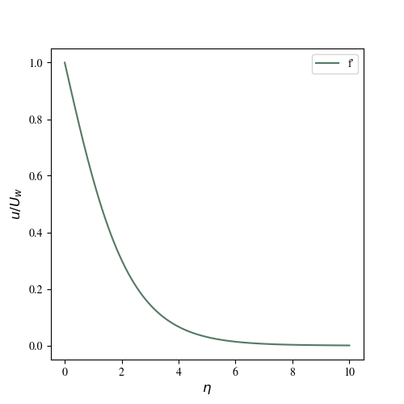
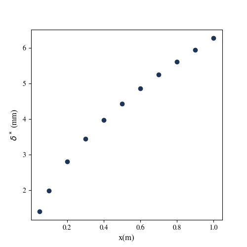
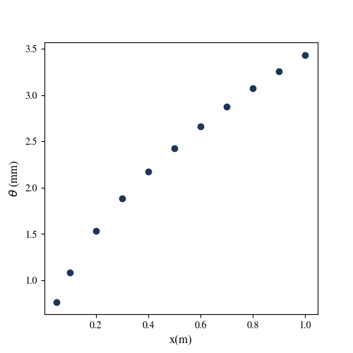
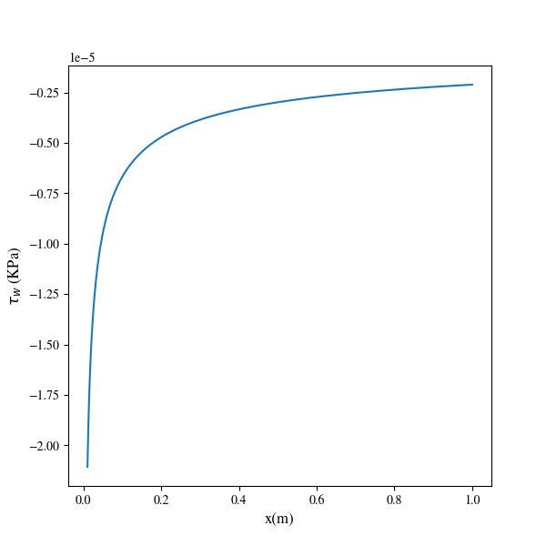
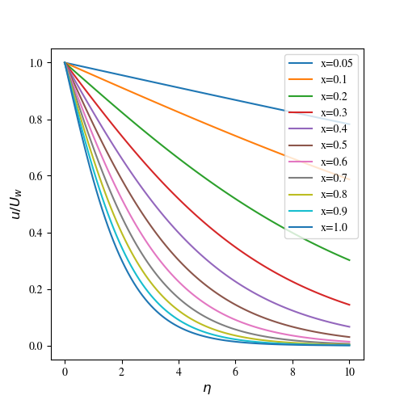
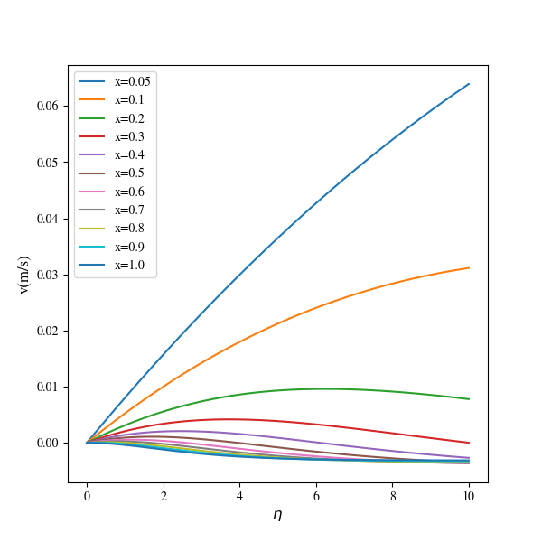

# Sakiadis Flow Analysis

This repository focuses on the simulation and analysis of Sakiadis flow, a classical problem in fluid mechanics involving boundary layer flow over a flat plate moving relative to a quiescent fluid. The project includes Python code to solve the governing equations of motion, analyze flow properties such as displacement thickness, momentum thickness, and wall shear stress, and visualize the results.

## Table of Contents
- [Introduction](#introduction)
- [Features](#features)
- [Installation](#installation)
- [Usage](#usage)
- [Code Explanation](#code-explanation)
- [Results and Visualizations](#results-and-visualizations)
- [References](#references)

---

## Introduction

Sakiadis flow is a fundamental problem in boundary layer theory, first introduced by B. C. Sakiadis in 1961. It describes the steady two-dimensional flow of an incompressible fluid over a semi-infinite plate moving with constant velocity relative to the fluid. This repository provides a numerical solution to the Sakiadis flow problem using Python and visualizes important physical quantities.

---

## Features

- Solves the boundary layer equations for Sakiadis flow using a numerical boundary value problem solver.
- Computes displacement thickness, momentum thickness, and wall shear stress.
- Visualizes results such as velocity profiles and thickness distributions.
- Provides detailed implementation and plots for better understanding.

---

## Installation

1. Clone the repository:
   ```bash
   git clone https://github.com/Aminhs0/Sakiadis-Flow-Analysis.git
   cd Sakiadis-Flow-Analysis
   ```

2. Install the required Python dependencies:
   ```bash
   pip install -r requirements.txt
   ```

---

## Usage

Run the `Sakiadis.py` script to compute and visualize the results:
```bash
python Sakiadis.py
```

---

## Code Explanation

The `Sakiadis.py` script includes the following main components:
1. **Boundary Value Problem (BVP) Solver**:
   - The `sakiadis_flow` function defines the system of differential equations.
   - The `bc` function specifies the boundary conditions.
   - The `solve_bvp` function is used to solve the equations numerically.

2. **Flow Properties**:
   - Computes displacement thickness (`delta_star`) and momentum thickness (`theta`).
   - Calculates wall shear stress (`tau_w`) based on the velocity gradient at the wall.

3. **Visualization**:
   - Plots the velocity profile, displacement thickness, momentum thickness, and wall shear stress.

---

## Results and Visualizations

### Velocity Profile
The velocity profile shows the variation of velocity along the boundary layer. Below is an example plot:



### Displacement Thickness
The displacement thickness is plotted against the distance along the plate:



### Momentum Thickness
The momentum thickness is illustrated in the plot below:



### Wall Shear Stress
The wall shear stress distribution along the plate is shown here:



### Transverse Velocity
The transverse velocity is computed and visualized:



### Combined Visualizations
A summary figure combining key visualizations is also provided:



---

## References

- Sakiadis, B. C. (1961). Boundary-layer behavior on continuous solid surfaces: I. Boundary-layer equations for two-dimensional and axisymmetric flow. *AIChE Journal, 7*(1), 26-28.
- Numerical methods for solving boundary value problems in Python: [Scipy Documentation](https://docs.scipy.org/doc/scipy/reference/generated/scipy.integrate.solve_bvp.html)

---

Feel free to star ⭐ this repository if you found it useful, and open an issue if you have any questions or suggestions!
